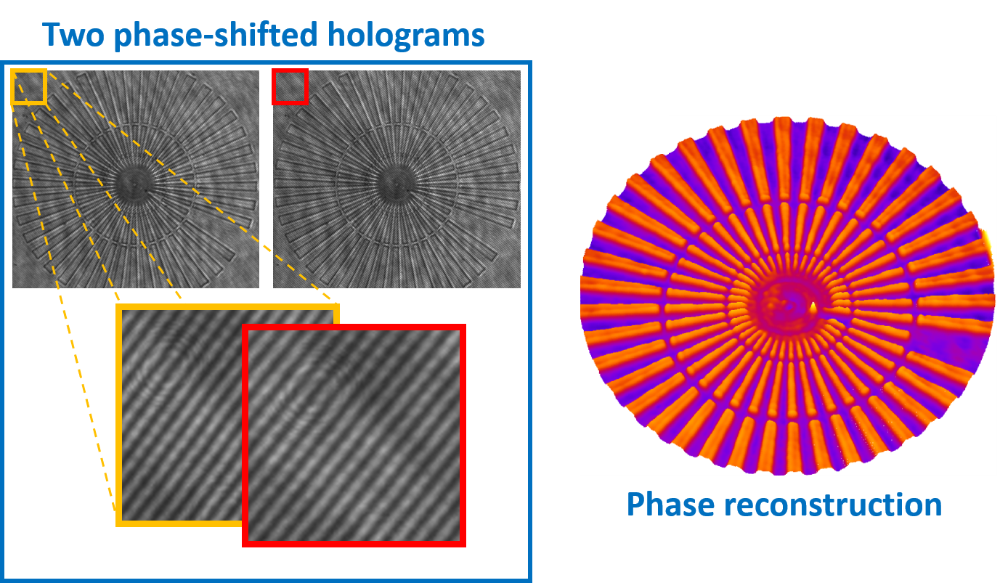

## Blind-PS-DHM-methods
### Fast, automatic and accurate methods 

We present two blind-iterative phase-shifting algorithms in which there is no need for prior knowledge of the phase shifts between the raw holograms. These two approaches provide accurate quantitative phase images in Phase-Shifting Digital Holographic Microscopy (PS-DHM) using three or two raw holograms. The proposed methods are based on the demodulation of the spectral components of the recorded holograms. The hallmarks of our methods are blindness (no prior knowledge of any phase shift), accuracy, and reduced acquisition and processing times leading to a PS-DHM system more suitable for dynamic imaging, as is the case of live cell imaging and colloidal systems


### Blind three raw holograms

This method uses three raw holograms with arbitrary phase-shift. The only requirement of this approach is that the PS-DHM system should operate in a slightly off-axis regime with an overlay between the different spectral orders up to 80%. Thus, the Fourier components of the real and virtual images (e.g., +1 and -1 terms) can be partially overlapped. 

<p align="center">
  
</p>

### Blind two raw holograms

This method uses two raw holograms with arbitrary phase-shift. Since in this implementation we only use two holograms, there is a 33% reduction in both the acquisition and computational time compared with the previous blind three-frame PS-DHM algorithms. The advantage of the reduced acquisition and processing times leads to a PS-DHM system more suitable for dynamic imaging. However, the requirement of this approach is that the PS-DHM system should operate in a slightly off-axis regime without overlapping the spectra of the ±1 terms.

<p align="center">
 
</p>

### Script 
Both approaches **Blind three raw holograms** and **Blind two raw holograms** are implemented in scripts for Python and MATLAB. If you are interested in obtaining them, please get in touch, more info in Support or Contact

### Python Script 


### MATLAB Script 
The matlab version for both approaches contains seven function. The main script are called **Blind_trhee_PS_DHM** and **Blind_two_PS_DHM.m**, for both approaches blind three and two raw holograms, respectively. Inside each main script you can find an explination for working with the methods.   
```markdown
% ------------------------------Specifications---------------------------------% 
% Input:                                                                       %
%     holo_1 = Recorded slight Off-axis Hologram 1                             %
%     holo_2 = Recorded slight Off-axis Hologram 2 (phase-shift)               %
%     holo_3 = Recorded slight Off-axis Hologram 3 (phase-shift)               %
%     lambda = wavelength                                                      % 
%     pixel size = dxy                                                         %
%                                                                              %
% Output: phase = Reconstructed Amplitude and Phase Image                      %
%                                                                              %
% Functions: The algorith implement a set of functions                         %
%   - holos_read                                                               %
%   - holos_ft_peaks_positions                                                 %
%   - cost_function_2RawImg                                                    %
%   - holo_filter                                                              %
%   - reference_wave                                                           % 
%   - cost_function                                                            %
%   - phase_reconstruction                                                     %
%   - unwrap_phase                                                             %
%                                                                              %
%%%%%%%%%%%%%%%%%%%%%%%%%%%%%%%%%%%%%%%%%%%%%%%%%%%%%%%%%%%%%%%%%%%%%%%%%%%%%%%%
```

### Funding
This project has received funding from the University of Memphis

### Credits
* **Blind three raw holograms** and **Blind two raw holograms** were developed in MATLAB (2020). version 7.10.0 (R2020a). Natick, Massachusetts: The MathWorks Inc.

* For the unwrapping step implements the code developed by *M.A. Herraez et.al.* 

M. A. Herraez, D. R. Burton, M. J. Lalor, and M. A. Gdeisat, "Fast two-dimensional phase-unwrapping algorithm based on sorting by reliability following a noncontinuous path", Applied Optics, Vol. 41, Issue 35, pp. 7437-7444 (2002).  

M. F. Kasim, "Fast 2D phase unwrapping implementation in MATLAB" [unwrapping](https://github.com/mfkasim91/unwrap_phase/). 

### Citation
* If using blind three raws holograms algorithm for publication, please kindly cite the following:

 C. Buitrago, A. Robinson, J. Garcia-Sucerquia and A. Doblas, “Phase-shifting digital holographic microscopy with an iterative blind reconstruction algorithm,” Appl. Opt. 58, 34, p.p G311–G317 (2019)[Article](https://www.osapublishing.org/ao/abstract.cfm?uri=ao-58-34-G311).

* If using two blind two raws holograms algorithm for publication, please kindly cite the following:

R. Castaneda, C. Buitrago, J. Garcia-Sucerquia and A. Doblas, “Fast-iterative blind phase-shifting digital holographic microscopy using two images,” Appl. Opt. 59, 24, p.p 7469–7476 (2020)[Article](https://www.osapublishing.org/ao/abstract.cfm?uri=ao-59-24-7469).  


### Support or Contact

| Researcher  | email | Google Scholar | ResearchGate |
| ------------- | ------------- |-------------| -------------|
| Raul Castaneda | *rcstdq@memphis.edu* | [RaulGoogle](https://scholar.google.com/citations?user=RBtkL1oAAAAJ&hl=en) | [RaulResearch](https://www.researchgate.net/profile/Raul_Castaneda_Quintero)
| Ana Doblas| *adoblas@memphis.edu* | [AnaGoogle](https://scholar.google.es/citations?user=PvvDEMYAAAAJ&hl=en) | [AnaResearch](https://www.researchgate.net/profile/Ana_Doblas2) |

The main researcher of Blind PD-DHM project is Ana Doblas 
